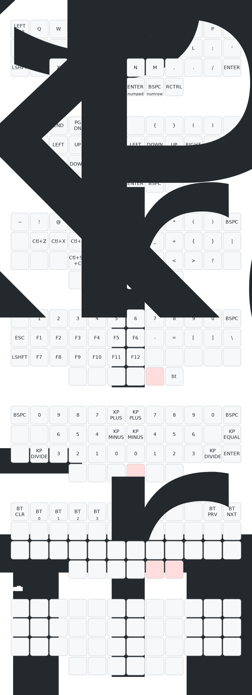

# zmk-config-sliver42

Follow along with [this video by Joe Scotto][yt-scotto-zmk],
and refer to the [New Keyboard Shield][zmk-new-shield] section of the ZMK docs.

> Drawn with [Keymap Drawer](/caksoylar/keymap-drawer)
_____________
_____________
[yt-scotto-zmk]: https://youtu.be/O_urj-rF3bQ
[zmk-new-shield]: https://zmk.dev/docs/development/new-shield
